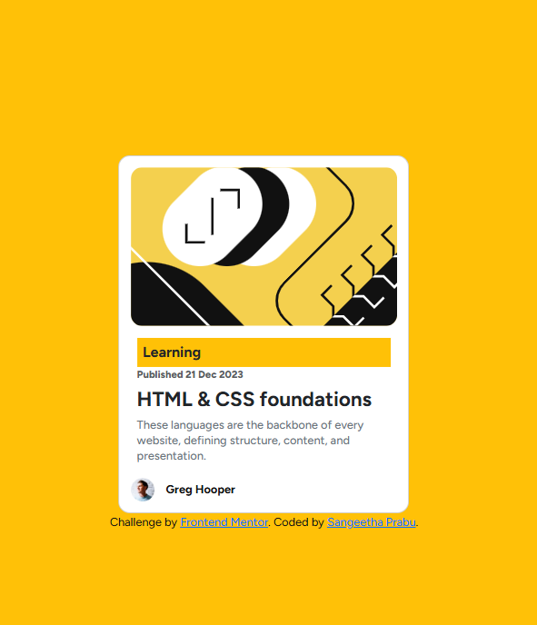

# Frontend Mentor - Blog preview card

## Welcome! 👋

This code has all the components developed to address the challenges of Blog Preview card using Bootstrap.

1. Replaced custom CSS with Bootstrap’s card component and utility classes.
2. Used Bootstrap’s text utilities (e.g., text-muted, text-primary) for consistent typography.
3. Responsive design using Bootstrap’s grid system and responsive classes.
